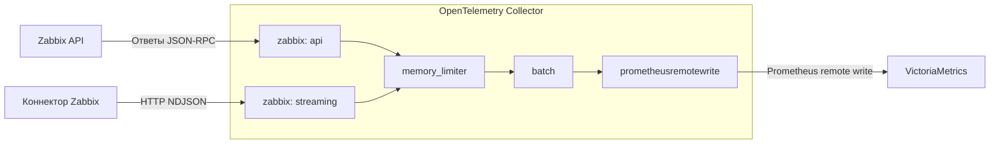

# Архитектура

[Карта документации](README.md) · [Настройка](configuration.md) · [Разработка](development.md)

Этот документ описывает компоненты и границы ответственности текущей рабочей копии. Параметры, контракт метрик и обработка ошибок собраны в [справочнике настройки](configuration.md); команды установки — в [руководстве по развёртыванию](deployment.md).

## Поток данных

В API-режиме запросы инициирует приёмник; в Streaming отправку инициирует коннектор Zabbix.



Состав конвейера задаётся YAML. Рабочие примеры используют `memory_limiter` и `batch`; демонстрация включает оба режима и только `batch`. [Сборка Collector](../cmd/otelcol-zabbix/components.go) регистрирует эти компоненты, расширение `health_check` и стандартную телеметрию Collector. Приёмник поддерживает сигнал metrics с уровнем стабильности `Development`.

Граница приёмника — вызов `consumer.Metrics.ConsumeMetrics`. Буферизация процессорами, экспорт и служебные HTTP-интерфейсы принадлежат Collector. Модуль приёмника не зависит от VictoriaMetrics и не обращается к базе данных Zabbix напрямую. Собственного веб-приложения нет: демонстрация использует внешние Zabbix UI и VictoriaMetrics VMUI.

## Структура кода

```text
zabbix-otel/
├── cmd/otelcol-zabbix/                 # Точка входа и состав сборки Collector
│   ├── main.go                        # Команды Collector, версия, источники конфигурации
│   └── components.go                  # Регистрация приёмника, процессоров и экспортёра
├── receiver/zabbixreceiver/            # Самостоятельный Go-модуль приёмника
│   ├── config.go                      # Конфигурация, значения по умолчанию, валидация
│   ├── factory.go                     # Фабрика компонента OpenTelemetry
│   ├── receiver.go                    # Жизненный цикл, сбор API и общая передача downstream
│   ├── scheduler.go                   # Интервалы, случайные задержки, отмена задач
│   ├── streaming.go                   # HTTP-сервер и преобразование истории NDJSON
│   ├── telemetry.go                   # Внутренняя телеметрия приёмника
│   ├── internal/
│   │   ├── zabbix/                    # Типизированный клиент JSON-RPC
│   │   ├── discovery/                 # Фильтры, лимиты, неизменяемый снимок метаданных
│   │   └── metrics/                   # Общая нормализация, лейблы и точки API/Streaming
│   ├── *_test.go                      # Тесты рядом с реализацией, также в internal/
│   └── go.mod                         # Зависимости публикуемого модуля
├── internal/packaging/                # Проверки документации и артефактов поставки
├── configs/                           # Примеры запуска в режимах API и Streaming
├── examples/ocb/                      # Пример подключения опубликованного модуля
├── testdata/ocb/                      # Конфигурация Builder для проверки локального модуля
├── deployments/
│   ├── systemd/                      # Unit, конфигурация и пример окружения
│   └── kubernetes/                    # Kustomize, Deployment, Service, ConfigMap и Secret
├── demo/                              # Начальная настройка, генератор и проверка данных
├── scripts/package-release.sh         # Сборка и проверка архивов релиза
├── docs/                              # Руководства и история архитектурных решений
│   └── architecture.md                # Этот документ
├── .github/workflows/                 # CI и публикация релизов
├── compose.yaml                       # Полная демонстрационная среда
├── Dockerfile                         # Контейнер специализированной сборки Collector
├── Makefile                           # Сборка, тесты, проверка конфигурации и демонстрация
├── go.mod                             # Зависимости корневой сборки
├── README.md                          # Обзор и быстрый старт
└── LICENSE                            # Apache License 2.0
```

В репозитории два Go-модуля. Корневой `github.com/wieso/zabbixreceiver` собирает исполняемый файл и проверяет поставку. Вложенный `github.com/wieso/zabbixreceiver/receiver/zabbixreceiver` публикуется независимо и подключается через [Collector Builder](../receiver/zabbixreceiver/README.md). Корневой модуль использует локальный `replace`; вложенный от корневого не зависит.

| Компонент | Ответственность |
| --- | --- |
| [config.go](../receiver/zabbixreceiver/config.go), [factory.go](../receiver/zabbixreceiver/factory.go) | Значения по умолчанию, проверка конфигурации и создание изолированных экземпляров приёмника |
| [receiver.go](../receiver/zabbixreceiver/receiver.go) | Жизненный цикл, обнаружение и получение значений API; общая передача downstream и безопасное представление его ошибок |
| [scheduler.go](../receiver/zabbixreceiver/scheduler.go) | Отдельный последовательный цикл для каждой задачи, интервалы, jitter и отмена |
| [internal/zabbix](../receiver/zabbixreceiver/internal/zabbix/) | Типизированный клиент JSON-RPC: `host.get`, `item.get` и аутентификация |
| [internal/discovery](../receiver/zabbixreceiver/internal/discovery/) | Отбор элементов и публикация снимка метаданных |
| [internal/metrics](../receiver/zabbixreceiver/internal/metrics/) | Общие проверка чисел и времени, нормализация имён, лейблы и построение точек gauge для API/Streaming |
| [streaming.go](../receiver/zabbixreceiver/streaming.go) | HTTP-сервер, разбор NDJSON и преобразование входящей истории |
| [telemetry.go](../receiver/zabbixreceiver/telemetry.go) | Инструменты наблюдаемости через инфраструктуру Collector |

## Состояние и параллелизм

В API обнаружение публикует неизменяемый снимок через `discovery.Store` (`atomic.Pointer[Snapshot]`); читатель получает копию списка. Сбор значений использует один снимок в течение цикла. Задачи обнаружения и сбора могут работать параллельно, но каждая задача выполняется последовательно. При перезапуске снимок строится заново. Подробные правила отбора, замены снимка и передачи пакета находятся в [описании обнаружения](configuration.md) и [цикла значений](configuration.md).

Streaming создаёт HTTP-сервер. По умолчанию API-клиент и планировщик не используются; отбор выполняет отправитель. При `streaming.enrich_with_api: true` задача discovery обновляет общий неизменяемый кэш с индексом по `itemid`, а обработчик берёт один снимок на весь запрос. Задача values в Streaming не запускается. Запросы обрабатываются параллельно и полностью разбираются перед передачей метрик. Оба режима используют `ParseSample` и `AppendGauge` из `internal/metrics/builder.go`, нормализацию имён из `internal/metrics/name.go` и формирование [лейблов метаданных](metadata.md) из `internal/metrics/metadata.go`. При наличии ключа элемента имя строится из него; без ключа используется отображаемое название. Общий `deliver` в `receiver.go` передаёт пакет следующему компоненту и учитывает результат; подтверждение записи в VM отслеживается отдельно по exporter. Порядок проверки запросов, завершения сервера и гарантии доставки описаны в [контракте Streaming](configuration.md).

У приёмника нет собственного постоянного хранилища. В демонстрации PostgreSQL принадлежит Zabbix, VictoriaMetrics хранит временные ряды, а том `demo-config` содержит подготовленную конфигурацию Collector. Их создание и удаление описаны в [инструкции демонстрации](deployment.md).

## Границы масштабирования

Координации экземпляров, выбора лидера и автоматического разделения узлов API нет. Несколько одинаково настроенных API-приёмников опрашивают одни и те же элементы; это относится и к временному сосуществованию Pod при RollingUpdate. Поставляемый API Deployment использует Recreate, чтобы штатный rollout не запускал двух владельцев; обновление сопровождается перерывом сбора. Это не распределённая блокировка и не HA-механизм.

Память расходуется на снимок API, накопленные ответы и параллельные запросы Streaming. Лимит тела ограничивает один запрос, поэтому общая нагрузка зависит также от числа сеансов и пропускной способности следующих компонентов. Одного порогового числа узлов недостаточно для оценки нагрузки API: нужны количество элементов, частота опроса и производительность базы данных.

Изменения в именах и атрибутах метрик затрагивают запросы, панели и оповещения; их контракт поддерживается в [configuration.md](configuration.md). Проверки по областям кода перечислены в [руководстве разработчика](development.md).
