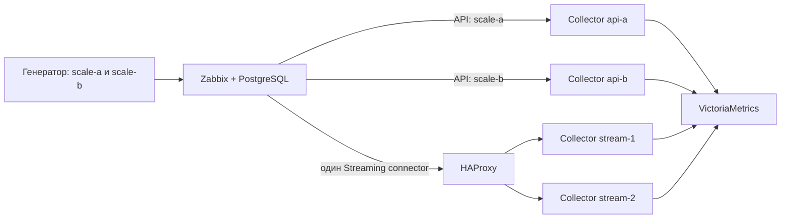

# Масштабирование Zabbix receiver

Контракт обновлён 11 сентября 2026 года; измерения ниже относятся к стенду 9 сентября. В сборке используются Collector и Prometheus remote-write exporter 0.160.0. Streaming в рабочей копии не означает его наличие в опубликованном релизе.

**API масштабируется разделением владения хостами, Streaming — распределением HTTP-запросов между коллекторами.** Простое увеличение `replicas` для API создаёт повторный опрос. Для больших потоков истории предпочтителен Streaming: API читает только последнее значение и не воспроизводит историю между опросами.

## Что установлено по коду

| Участок | Поведение и следствие |
| --- | --- |
| [receiver.go](../receiver/zabbixreceiver/receiver.go), `discover` | `host.get`, затем один `item.get` для всех видимых хостов. Regex-фильтры и `max_metrics_per_host` применяются после получения ответа. Они уменьшают snapshot и опрос значений, но не размер discovery-ответа. |
| [client.go](../receiver/zabbixreceiver/internal/zabbix/client.go) | Любой API-ответ ограничен **8 МиБ**. Discovery не имеет пагинации. Ни RAM, ни уменьшение `items_per_request` не исправят превышение этого лимита в discovery. |
| `receiver.go`, `values` | `items_per_request` разбивает только запросы значений; запросы выполняются последовательно. Затем все значения цикла преобразуются в один OTLP batch. Ошибка любого запроса отменяет выдачу всего цикла. |
| [scheduler.go](../receiver/zabbixreceiver/scheduler.go) | Две независимые задачи: discovery и values. Каждая ждёт `interval` **после** завершения работы, затем jitter; перекрытия одного задания нет. Реальный период длиннее настроенного. |
| [snapshot.go](../receiver/zabbixreceiver/internal/discovery/snapshot.go) | Snapshot хранится в RAM; получение элементов копирует slice. Discovery временно может сосуществовать со старым snapshot и обработкой values. |
| [builder.go](../receiver/zabbixreceiver/internal/metrics/builder.go) | По одному объекту Metric/Gauge на точку, дополнительная map метаданных по itemid; последнее значение и timestamp повторно выдаются при каждом опросе. |
| [streaming.go](../receiver/zabbixreceiver/streaming.go) | HTTP `/v1/history`, NDJSON, по одному Metric на числовую запись. Каталога хостов нет, но весь преобразованный запрос хранится в RAM до передачи downstream. По умолчанию тело до 10 МиБ; собственного ограничения числа одновременных обработчиков нет. |
| Streaming и downstream | При ошибке downstream возвращается 503; при успешном приёме — 200. С batch/очередью 200 означает приём в pipeline, а не подтверждённую запись в хранилище. Постоянной входной очереди и дедупликации в ресивере нет. |
| [components.go](../cmd/otelcol-zabbix/components.go) | Готовая сборка содержит `zabbix`, `memory_limiter`, `batch`, `prometheusremotewrite`, `health_check`. OTLP receiver/exporter, Kafka и Target Allocator в ней отсутствуют. Для отдельного слоя OTLP gateways нужна другая сборка. |

## Расчёт нагрузки и минимальный стартовый бюджет

Здесь «точка» — одно числовое значение одного item с timestamp. Число активных рядов и точек/с — разные параметры: 100 тысяч items с периодом 60 секунд дают около 1 667 новых точек/с, а те же items с периодом 1 секунда — 100 тысяч. Длинные имена, описания, наборы меток и размер каталога изменяют стоимость.

Таблицы ниже — **инженерный бюджет для начала нагрузочной проверки, не гарантированный минимум и не паспортная производительность**. Указаны ресурсы только коллекторов: Linux amd64/arm64, числовые gauge, короткие имена и несколько меток, исправное хранилище, локальная сеть, ограниченная очередь. Zabbix, PostgreSQL, балансировщик, ОС и VictoriaMetrics рассчитываются отдельно. На production нужен запас и проверка на своей машине.

### API: размер выбранного каталога на один активный шард

Принято `interval=30s`, `items_per_request=1000`. «Точки/с» — верхняя оценка количества выдаваемых точек `N/30`, включая повторы; это не скорость извлечения истории.

| Items на шард | Точки/с, не более | Values-запросов за цикл | Старт CPU / RAM на шард | Условия |
| ---: | ---: | ---: | --- | --- |
| 1 000 | 33 | 1 | 0,25 vCPU / 128 МиБ | Для малой установки; 256 МиБ удобнее для запаса |
| 10 000 | 333 | 10 | 0,5 vCPU / 256 МиБ | Проверить длительность values и discovery |
| 30 000 | 1 000 | 30 | 1 vCPU / 512 МиБ | Проверить размер **всего видимого** discovery-ответа |
| 100 000 суммарно | 3 333 | 100 суммарно при равном делении | 4 × (1 vCPU / 512 МиБ), по 25 000 items | Отдельные пользователи с непересекающимися правами видимости; regex с общим Admin-токеном недостаточно |
| 1 000 000 суммарно | 33 333 | 1 000 суммарно | Предпочтителен Streaming | Механическое продолжение схемы: около 40 шардов по 25 000; это 40 vCPU / 20 ГиБ стартового бюджета, но API/БД могут стать пределом значительно раньше |

Размер безопасного шарда определяется байтами ответа, а не универсальным числом items. При 150–300 байтах JSON на item предел 8 МиБ соответствует примерно 28–56 тысячам items **без запаса**. Для эксплуатации целиться в ответ до 4 МиБ; длинные поля уменьшают допустимое количество. Даже 25 тысяч items при 300 байтах уже выше этого целевого запаса.

Пусть `N` — items в шарде, `B` — items в запросе, `L` — средняя задержка одного API-запроса, `C` — преобразование и приём downstream. Тогда:

```text
values_duration ≈ ceil(N / B) × L + C
реальный период ≈ values_duration + interval + jitter/2
выдаваемые точки/с ≈ N / реальный период
API запросы/с ≈ сумма ceil(Nшарда / B) / периодшарда + 2 × shards / период_discovery
```

Пример: 30 тысяч items, B=1000, L=100 мс → не менее 3 секунд на values до преобразования. При `interval=30s` получаем менее 909 точек/с. Для 100 тысяч items и L=200 мс только запросы занимают 20 секунд — это весь стандартный timeout задания, ещё до преобразования. Добавлять CPU здесь недостаточно.

Оценка памяти API: базовый процесс + каталог видимых хостов/items при discovery + старый/новый snapshot + копия items и map + batch всех N точек + очереди экспортёра + резерв GC. Значения по частям сейчас не передаются downstream: `items_per_request` не ограничивает размер итогового batch.

### Streaming: суммарный входной поток

Для расчёта приняты пакеты до 1000 записей, тело запроса до 1 МиБ, не более 4 активных запросов на worker, ограниченные очереди. Профиль 100 тысяч точек/с требует отдельной проверки высокой кардинальности и ресурса хранилища.

| Поток | Стартовый бюджет без отказоустойчивости | Пример с резервом на отказ одного worker |
| ---: | --- | --- |
| 100 точек/с | 1 × 0,25 vCPU / 128 МиБ | 2 × 0,25 vCPU / 256 МиБ |
| 1 000 точек/с | 1 × 0,5 vCPU / 256 МиБ | 2 × 0,5 vCPU / 256 МиБ |
| 10 000 точек/с | 2 × 1 vCPU / 512 МиБ | 3 × 1 vCPU / 512 МиБ |
| 100 000 точек/с | 10 × 2 vCPU / 1 ГиБ | 11 × 2 vCPU / 1 ГиБ |

Число реплик на верхних строках выбрано с запасом относительно микробенчмарка и требует проверки полной цепочки. Это не результат поиска минимально возможного числа CPU. Для планирования использовать измеренную безопасную производительность одного worker `q`: `ceil(total_rate/q)` рабочих экземпляров и дополнительно как минимум один для N+1. После отказа оставшиеся экземпляры должны выдержать полный поток с запасом.

При среднем размере строки NDJSON 200–500 байт входная сеть составляет 0,02–0,05 / 0,2–0,5 / 2–5 / 20–50 МБ/с для соответствующих строк таблицы, без TCP/TLS. Сжатый remote-write считается отдельно. HTTP-вход поддерживает gzip, zstd, deflate (zlib) и блочный snappy. Приведённая оценка сети относится к несжатому NDJSON; экономию сети и дополнительный CPU декодирования нужно измерять отдельно.

Прикидка памяти одного Streaming-worker:

```text
RAM ≈ baseline + concurrency × (body_bytes + decoder_memory + batch_points × point_cost)
      + pending_points × queued_point_cost + GC reserve
```

Начать можно с 2–4 КиБ на точку в pipeline как консервативного коэффициента, затем заменить его измерением RSS. Это не константа Go-структуры. Для сжатого входа добавляется память декодера: у zstd разрешено окно до 64 МиБ на запрос, snappy удерживает сжатый и распакованный буферы. Длинные метаданные увеличивают стоимость точки; byte limit не ограничивает общий расход памяти процесса. Например, 4 запроса × (1 МиБ + 1000 × 2 КиБ) ≈ 12 МиБ до учёта очередей. А стандартные 10 МиБ × 32 конкурентных запроса с десятками тысяч точек в каждом дают существенно больший пик. `memory_limiter` работает после построения входного batch и не предотвращает все выделения внутри HTTP-handler.

Для длительного отказа хранилища память линейно растёт с числом ожидающих точек, пока не сработают лимиты. Даже 10 000 точек/с × 60 с × 2 КиБ ≈ 1,14 ГиБ. Не задавать очереди «на несколько минут» без расчёта. При WAL оценивать диск: `rate × outage_seconds × measured_bytes_per_point × запас`; диск и персистентность настраиваются отдельно для каждой реплики. WAL экспортёра не делает входное подтверждение транзакционным.

## Как масштабировать API

1. Разделить хосты на устойчивые непересекающиеся группы: площадки, среды, диапазоны имён. На один хост должен приходиться один активный владелец. `^dc-a-` и `^dc-b-` — возможные regex для двух экземпляров.
2. На малом каталоге достаточно `host_include_regex` в каждом коллекторе. На большом — отдельный Zabbix-пользователь и API-токен с видимостью только своей группы; токены одного пользователя не дают разных прав. Сверять фактический `host.get`/`item.get` каждого пользователя.
3. Настроить независимые процессы/Deployment на шард, jitter и подходящие timeout. Увеличение числа реплик одного Deployment с одинаковым YAML не распределяет items. Kubernetes Service перед API-коллекторами проблему не решает: они сами инициируют запросы.
4. Контролировать длительность цикла, API-ошибки, размер discovery-ответа и нагрузку PHP/БД. Изменение `items_per_request` снижает число HTTP-запросов ценой большего ответа; лимит 8 МиБ действует и для values.
5. В одиночном API Deployment из комплекта используется Recreate: обновление прерывает сбор, зато не перекрывает старый и новый опрос. Для HA организовать внешнее active/passive управление с fencing/lease на шард либо управляемое переключение конфигурации. Встроенных leader election, передачи владения и checkpoint нет. Не запускать второй активный опрос того же набора ради HA без осознанной политики дублей.

При переносе хоста между шардами сначала прекратить старый опрос, затем запустить новый и дождаться discovery. Будет возможен разрыв; API не восстановит промежуточную историю. Существующий snapshot сохраняется при ошибке discovery, поэтому одной правки прав недостаточно для мгновенного прекращения старого опроса. Для многомиллионного каталога полезная будущая доработка — серверное ограничение discovery, его разбиение и выдача values по частям. Эти изменения в рамках демо не внесены.

## Как масштабировать Streaming

1. Один коннектор Zabbix отправляет историю на общий HTTP endpoint. Перед коллекторами — L7-балансировщик с health checks и распределением **каждого запроса**, например HAProxy из демо. Балансировка TCP-соединений может удерживать keep-alive на одном worker.
2. Workers используют одинаковый токен, prefix и бизнес-метки. Увеличивать одновременно доступные workers, `StartConnectors` и `max_senders` коннектора по результатам измерений. Несколько одинаковых коннекторов, каждый на свою реплику, рассылают копии, а не делят поток. Разные коннекторы допустимы с непересекающимися tag-фильтрами.
3. Ограничивать `max_records`, тело запроса и одновременные запросы. В демо: 100 записей у Zabbix-коннектора, 1 МиБ в receiver, HAProxy `maxconn 4` на worker, `max_senders=2`, `StartConnectors=4`. Настройка concurrency в балансировщике действует только для трафика через него; прямой доступ к workers закрывают сетью.
4. При 503/сетевом сбое Zabbix может повторить отправку в пределах настроенных попыток. Истёкшие попытки/перезапуск источника не образуют гарантированную постоянную очередь. 400/401/415 обычно требуют исправления данных или конфигурации, а не добавления реплик. Параметры и условия повторов: [Zabbix 7.4 Streaming](https://www.zabbix.com/documentation/7.4/en/manual/config/export/streaming).
5. Повтор запроса после неопределённого результата может дать дубли. Ошибки чтения/декодирования тела и превышение лимита отвергают весь пакет до downstream. Некорректные строки NDJSON и значения пропускаются с увеличением `invalid_values`; корректные строки такого запроса могут получить 200. Поэтому успешный HTTP-ответ не подтверждает приём каждой исходной строки; после 200 сбой batch/очереди/экспортёра всё ещё может потерять данные. Для строгих требований к доставке нужна дополнительная архитектура с устойчивым журналом и определёнными правилами подтверждения.
6. Несколько workers могут отправить один ряд в хранилище не по порядку. Учитывать поддержку out-of-order/dedup в backend. `num_consumers: 1` ограничивает локальный параллелизм экспортёра, но не задаёт общий порядок между репликами. Шардирование коннекторов по источнику полезно, если требуется устойчивое владение рядами.
7. В Kubernetes использовать Deployment Streaming-workers, Service/L7 ingress, requests/limits, readiness, постепенное завершение и масштабирование по CPU, задержке, отказам и заполнению очереди. Scale-down дренирует соединения и очередь; балансировщику и хранилищу также нужен резерв. Единственный HAProxy в демо сам остаётся точкой отказа.

`memory_limiter` ставится первым процессором, далее `batch` с `send_batch_max_size`; одно `send_batch_size` — только порог отправки. Очередь PRW задаётся через `remote_write_queue`, не через универсальный `sending_queue`. Единицы и WAL необходимо сверять с [документацией exporter 0.160.0](https://github.com/open-telemetry/opentelemetry-collector-contrib/blob/v0.160.0/exporter/prometheusremotewriteexporter/README.md). Общие принципы распределения pull/push-нагрузки: [Scaling the Collector](https://opentelemetry.io/docs/collector/scaling/).

## Демо с четырьмя коллекторами



[Compose](../demo/scaling/compose.yaml) использует отдельный проект `zabbix-otel-scaling`, сеть, тома и порты. Требуется Docker Compose 2.24.4+ (`!override`). Разумный стартовый бюджет для **всего малонагруженного стенда** — 4 vCPU, 4 ГиБ RAM и 10 ГиБ свободного диска, плюс ресурсы сборки образа. Это лабораторный стенд с демонстрационными паролями; PostgreSQL/Zabbix/VM здесь не рассчитаны на production-поток из верхних строк таблиц.

```bash
make scaling-up
make scaling-verify
make scaling-failover
```

Проверка ожидает свежие значения из обоих API-шардов и обоих Streaming-workers и отклоняет перекрёстное API-владение. Проверка отказа сначала проверяет обоих workers, останавливает `stream-1`, проверяет свежие значения только от `stream-2`, возвращает `stream-1` и снова проверяет обоих. При ошибке trap пытается восстановить остановленный worker. Это проверка продолжения доставки, а не доказательство отсутствия потерь каждого промежуточного значения при отказе.

Доступ:

- [Zabbix](http://localhost:18080): `Admin` / `zabbix`.
- [VictoriaMetrics VMUI](http://localhost:18428/vmui).
- Порты меняются через `SCALING_ZABBIX_PORT` и `SCALING_VM_PORT`.

Для просмотра в VMUI:

```promql
{__name__=~"scale_(api_demo_counter|stream_Scaling_counter)",env="scaling"}
```

API выдаёт `scale_api_demo_counter`, Streaming — `scale_stream_Scaling_counter`: в коде имя API строится из `key_`, Streaming — из `name`. Метка `collector` добавлена **для доказательства маршрутизации**. Она создаёт разные ряды для разных workers, поэтому не складывайте их как независимые значения хоста; в production обычно оставляют одинаковые бизнес-метки и наблюдают распределение через внутреннюю телеметрию. Демонстрационное разделение рядов не проверяет порядок/дедупликацию одного общего ряда между workers.

Оба API-шарда демо используют общий административный токен и regex на два хоста. Это демонстрация распределения values, не способ обхода лимита discovery. Токены с разными правами для большого каталога описаны выше. Секреты генерируются в закрытом Compose-томе; конфигурации принадлежат UID 10001 и читаются коллекторами. Повторный bootstrap сохраняет токены, чтобы не ломать работающие экземпляры.

Остановка с удалением **данных этого стенда**:

```bash
make scaling-down
```

## Измерения и повторение

Полная цепочка Streaming проверена 9 сентября 2026 года на Docker Desktop Linux/aarch64: Docker Engine 29.6.2, VM с 8 CPU и 8,32 ГБ RAM, хост Apple M2. **Каждый из двух Streaming-контейнеров ограничен 0,5 CPU и 256 МиБ RAM**; параллельно работали оба API-шарда и остальные сервисы демо. Нагрузочные прогоны по 30 секунд подтверждают работоспособность при этих лимитах, но не определяют минимальный ресурс и не являются длительным тестом.

| Задано, точек/с | Отправлено / записано | Фактическая подача, точек/с | HTTP p95 | Max CPU одного worker в выборке | Max память одного worker в выборке |
| ---: | ---: | ---: | ---: | ---: | ---: |
| 100 | 3 000 / 3 000 | 100,0 | 9,79 мс | 0,92% | 12,37 МиБ |
| 1 000 | 30 000 / 30 000 | 1 000,0 | 12,39 мс | 1,97% | 19,02 МиБ |
| 10 000 | 300 000 / 300 000 | 9 999,6 | 15,41 мс | 27,43% | 18,44 МиБ |

HTTP p95 измеряет ответ receiver/pipeline, не время записи в VictoriaMetrics. Число точек в хранилище проверено отдельно после подачи. В этих прогонах строка NDJSON составляла около 134–135 байт, хост один на прогон, itemid — до 1000; большой каталог, длительный отказ backend и 100 тысяч точек/с не измерялись. Сырые результаты и выборки `docker stats`: [scaling-load.json](benchmarks/scaling-load.json). Протокол успешной проверки отказа и восстановления: [scaling-failover.txt](benchmarks/scaling-failover.txt).

CPU 100% в `docker stats` соответствует одному полностью занятому CPU. Выборки сделаны раз в несколько секунд и включают завершение экспорта; это наблюдавшиеся максимумы, а не точные пики. Linux Docker показывает память с поправкой на файловый кеш, не тождественную RSS. Workers не перезапускались между ступенями, поэтому GC и прогрев влияют на цифры; из 19 МиБ наблюдаемой памяти нельзя выводить безопасный лимит контейнера 19 МиБ.

Микробенчмарки: [исходный код](../receiver/zabbixreceiver/scaling_benchmark_test.go), [сырые результаты](benchmarks/scaling-darwin-arm64.txt). Apple M2, darwin/arm64, Go 1.26.5, `-cpu=1`, по три прогона. Идентификатор коммита этих измерений не сохранён; результаты являются историческим профилем, а не приёмкой текущих метаданных и сжатия. Машина выполняла и другие задачи, поэтому wall-clock throughput заметно меняется; использовать эти данные прежде всего для оценки выделений и масштабирования объёма batch.

| Микробенчмарк | Размер batch | Выделения за операцию | Что включено |
| --- | ---: | ---: | --- |
| API Build | 1 000 | 1,24 МБ | Построение OTLP и проверка числа точек |
| API Build | 10 000 | 12,04 МБ | То же |
| API Build | 100 000 | 117,83 МБ | То же; это не рабочий discovery на 100 тысяч |
| Streaming handler | 100 | 0,128 МБ | NDJSON, проверки, OTLP, HTTP recorder, неперсистентный consumer |
| Streaming handler | 1 000 | 1,17 МБ | То же |
| Streaming handler | 10 000 | 11,76 МБ | То же |

API Build не включает discovery, HTTP/JSON API, snapshot, batch processor и remote-write. Streaming benchmark не включает сеть, конкурентные запросы, экспорт и хранение, использует короткую строку 107 байт и повторный itemid. **B/op — накопленные выделения, не RSS и не удерживаемая память**. Скорость такого теста нельзя выдавать за производительность полной системы.

```bash
make scaling-bench
RATE=100 DURATION=30 make scaling-load
RATE=1000 DURATION=30 make scaling-load
RATE=10000 DURATION=30 make scaling-load
```

Нагрузочный сценарий отправляет синтетическую историю непосредственно на HAProxy, обходя Zabbix. Он использует до 1000 записей в запросе, 1000 itemid, два HTTP-потока и уникальный host на прогон. Проверяет количество сырых записанных точек через `/api/v1/export`, а не только HTTP 200. Успех требует доставки точного числа точек и средней скорости не ниже 95% заданной. Для проверки Zabbix-коннектора служат `scaling-verify` и `scaling-failover`; нагрузочный тест не измеряет пропускную способность самого Zabbix.

При подборе production-ресурсов повторить ступени на своей машине не менее 15–30 минут: сначала равномерный поток, затем burst, рост числа уникальных items и длинных меток, недоступность backend и отказ worker. Собирать RSS/CPU/throttling, задержку до хранилища, ошибки discovery/values, очередь/ошибки экспортёра и сравнивать отправленные/записанные точки. Встроенные счётчики `otelcol_receiver_zabbix_*` помогают, `emitted_points` в обоих режимах увеличивается после успешного downstream, но при наличии batch/очереди это не доказывает доставку в backend.
